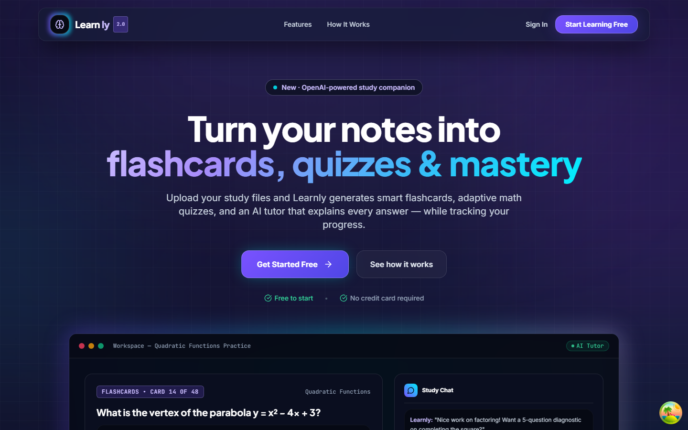

# Learnly

A responsive AI study companion that turns learning materials into flashcards, adaptive quizzes, guided explanations, and visible progress.



## Overview

Learnly brings several study workflows into one web application. Learners can upload notes, generate flashcards, practise with adaptive quizzes, ask an AI tutor for step-by-step explanations, revisit previous conversations, and track performance across topics.

The frontend is designed as both a conversion-focused product website and a logged-in learning workspace. It combines a clear landing narrative with responsive application navigation, reusable interactive components, deliberate loading and empty states, and study experiences that remain usable across desktop and mobile screens.

## Product experience

### Public landing experience

- Responsive product navigation and mobile menu
- Clear feature, workflow, and call-to-action sections
- Interactive product mock-ups that explain the learning experience before signup
- Focused authentication entry points for new and returning learners
- Dark visual system with controlled gradients, glass surfaces, and restrained motion

### Learning workspace

- Session-based AI study chat with image and document input
- Generated flashcard decks and manual card creation
- Recall ratings, adaptive drills, deck quizzes, and review states
- Topic-based quizzes, simulated exams, scoring, explanations, and result review
- Resource management for uploaded learning material
- Profile and progress views with trends, streaks, and topic breakdowns
- Desktop sidebar and mobile bottom navigation
- Skeleton loading states, error boundaries, offline awareness, and toast feedback

## Frontend engineering

- Route-level code splitting for the main learning experiences
- TanStack Query for server-state management and caching
- Typed API service boundaries for authentication, chat, quizzes, flashcards, and profile data
- React Hook Form and Zod-backed form workflows
- Sanitized rich text and secure mathematical rendering with DOMPurify and KaTeX
- Responsive layout primitives built with Tailwind CSS and Radix UI
- Framer Motion and CSS transitions for purposeful interface feedback
- Service-worker support for production delivery
- Semantic labels, keyboard-aware controls, and accessible component primitives

## Technology

| Area | Stack |
| --- | --- |
| Application | React 18, TypeScript, Vite, React Router |
| Styling and UI | Tailwind CSS, Radix UI, shadcn/ui patterns, Framer Motion, Lucide icons |
| Data and forms | TanStack Query, React Hook Form, Zod |
| Learning content | KaTeX, React KaTeX, DOMPurify |
| Visualisation | Recharts |
| Backend integration | FastAPI API with JWT authentication |

## Application routes

| Route | Purpose |
| --- | --- |
| `/` | Product landing page |
| `/chat` | AI tutor and study conversations |
| `/flashcards` | Deck creation, practice, and adaptive review |
| `/quizzes` | Quiz selection, active sessions, and results |
| `/resources` | Uploaded learning materials |
| `/profile` | Learner profile and progress |
| `/login`, `/signup` | Authentication |

## Project structure

```text
src/
  components/
    auth/                Authentication experiences
    chat/                Tutor messages, composer, uploads, and rendering
    flashcards/          Practice, quizzes, analytics, and adaptive drills
    landing/             Public product narrative
    layout/              Sidebar, top bar, and mobile navigation
    skeletons/           Route-specific loading states
    ui/                  Reusable interface primitives
  hooks/                 Profile, onboarding, connectivity, and query hooks
  lib/                   Shared validation, security, and utility modules
  pages/                 Route-level product screens
  services/              Typed API clients and token handling
```

The companion backend is documented in [the Learnly API README](../learnly_api/README.md).

## Local development

### Prerequisites

- Node.js 20+
- npm
- A running Learnly API, or access to the configured hosted API

### 1. Configure the API endpoint

```powershell
Copy-Item .env.example .env
```

For local development, the example configuration uses the Vite proxy:

```ini
VITE_API_BASE_URL=/api/v1
```

For deployment, set `VITE_API_BASE_URL` to the public API base URL in the hosting provider's environment settings.

### 2. Install and run

```powershell
npm ci
npm run dev
```

Vite prints the local URL when the development server is ready.

## Production checks

```powershell
npm run lint
npm run build
npm run preview
```

The production build performs TypeScript compilation, asset optimization, and route chunk generation. Review the generated bundle report when adding large learning experiences or visualisation dependencies.

## Design workflow and ownership

Lovable and Stitch were used during early ideation and visual iteration. The maintained application in this repository is implemented in React and TypeScript, with its responsive layouts, application routes, data integration, reusable components, loading states, and interaction behaviour developed and refined in code.

That distinction matters for evaluating the work: the portfolio value is not a static mock-up, but the translation of product requirements and visual direction into a working, responsive frontend connected to a real learning API.
